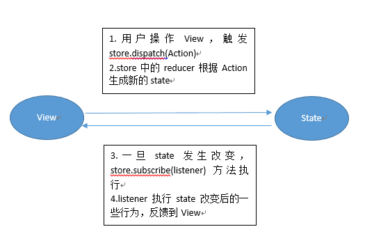

# 是什么？
首先了解Redux是什么的问题，Redux 的设计思想很简单，就两句话：

（1）Web 应用是一个状态机，视图与状态是一一对应的。\
（2）所有的状态，保存在一个对象里面。

React开发中Redux并不是必须的，而且简单的应用并不建议使用Redux。
Redux 的适用场景：多交互、多数据源。

# 怎么用？
首先理解几个概念：
### Store
Store 就是保存数据的地方，你可以把它看成一个容器。整个应用只能有一个 Store。
Redux 提供createStore这个函数，用来生成 Store
```
import { createStore } from 'redux';
const store = createStore(fn);
```
上面代码中，createStore函数接受另一个函数作为参数，返回新生成的 Store 对象。
### State
这里state要和React中的state区分开，可把store看成一个对象，而state是store的一个保存数据的集合。当前时刻的 State，可以通过store.getState()拿到。
### Action
State 的变化，会导致 View 的变化。但是，用户接触不到 State，只能接触到 View。所以，State 的变化必须是 View 导致的。Action 就是 View 发出的通知，表示 State 应该要发生变化了。
### Reducer
Store 收到 Action 以后，必须给出一个新的 State，这样 View 才会发生变化。这种 State 的计算过程就叫做 Reducer。
Reducer 是一个函数，它接受 Action 和当前 State 作为参数，返回一个新的 State。
```
const reducer = function (state, action) {
  // ...
  return new_state;
};
```
整个应用的初始状态，可以作为 State 的默认值。下面是一个实际的例子。
```
const defaultState = 0;
const reducer = (state = defaultState, action) => {
  switch (action.type) {
    case 'ADD':
      return state + action.payload;
    default: 
      return state;
  }
};

const state = reducer(1, {
  type: 'ADD',
  payload: 2
});
```
到了这里，你可以把Action当成房卡，而Reducer就是门禁系统。当你刷对房间时，门禁才会让你进入房间
### state和view
Redux 规定， 一个 State 对应一个 View。只要 State 相同，View 就相同。你知道 State，就知道 View 是什么样，反之亦然。
### store.dispatch()
store.dispatch()是 View 发出 Action 的唯一方法。
### store.subscribe()
Store 允许使用store.subscribe方法设置监听函数，一旦 State 发生变化，就自动执行这个函数。
```
import { createStore } from 'redux';
const store = createStore(reducer);

store.subscribe(listener);
```
显然，只要把 View 的更新函数（对于 React 项目，就是组件的render方法或setState方法）放入listen，就会实现 View 的自动渲染。
### createStore
下面是createStore方法的一个简单实现，可以了解一下 Store 是怎么生成的。
```
const createStore = (reducer) => {
  let state;
  let listeners = [];

  const getState = () => state;

  const dispatch = (action) => {
    state = reducer(state, action);
    listeners.forEach(listener => listener());
  };

  const subscribe = (listener) => {
    listeners.push(listener);
    return () => {
      listeners = listeners.filter(l => l !== listener);
    }
  };

  dispatch({});

  return { getState, dispatch, subscribe };
};
```
### Redux基本工资流程

不知道准不准确，但大体意思差不多...

### Demo：Counter计数器
```
const Counter = ({ value, onIncrement, onDecrement }) => (
  <div>
  <h1>{value}</h1>
  <button onClick={onIncrement}>+</button>
  <button onClick={onDecrement}>-</button>
  </div>
);

const reducer = (state = 0, action) => {
  switch (action.type) {
    case 'INCREMENT': return state + 1;
    case 'DECREMENT': return state - 1;
    default: return state;
  }
};

const store = createStore(reducer);

const render = () => {
  ReactDOM.render(
    <Counter
      value={store.getState()}
      onIncrement={() => store.dispatch({type: 'INCREMENT'})}
      onDecrement={() => store.dispatch({type: 'DECREMENT'})}
    />,
    document.getElementById('root')
  );
};

render();
store.subscribe(render);
```